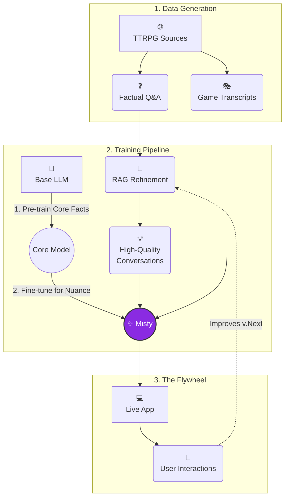

# Misty ✨

**Your AI companion for all things Tabletop RPG.**

Misty is a specialized AI designed with a deep, accurate knowledge of TTRPG domains like Dungeons & Dragons 5e, Pathfinder, and more. Trained with data generated from a custom RAG (Retrieval-Augmented Generation) pipeline, Misty provides detailed and context-aware answers to your TTRPG questions.

<p align="center">
  <a href="https://chati-836177676205.us-central1.run.app/" target="_blank" rel="noreferrer noopener">
    
  </a>
  &nbsp;
  <a href="https://colab.research.google.com/drive/1GxO1RO-WKDh3MV9KcupjJ1FoOLlESL9z?usp=sharing" target="_blank" rel="noreferrer noopener">
    
  </a>
  &nbsp;
  <a href="https://ollama.com/mltheuser/llama-misty-slim" target="_blank" rel="noreferrer noopener">
    
  </a>
</p>

---

## 🚀 The Official Misty Experience

The latest and most powerful version of Misty is available exclusively through our live web app. This version is continuously updated with the newest features, data, and model improvements.

<p align="center">
  <a href="https://chati-836177676205.us-central1.run.app/" target="_blank" rel="noreferrer noopener">
    
  </a>
</p>

---

## 📊 Performance

Here's a quick comparison showing how `Misty-Slim v2.0` stacks up against it's base model `Gemma3 12b` and the bigger closed source `Gemini-2.5-flash` on a TTRPG-focused benchmark. We evaluated responses across several key areas, with Misty's specialized training showing a distinct advantage in nuanced, domain-specific tasks.

| **DnD 5e**         | Misty              | Gemini-2.5-flash | Gemma3 12b |
| :----------------- | :----------------- | :--------------- | :----- |
| AdventurePrep      | **62.4**           | 31.5             | 6.1    |
| Character Building | **48.9**           | 42.3             | 8.8    |
| GMing              | **75.5**           | 21.0             | 3.5    |
| Intelligence       | **54.1**           | 39.6             | 6.3    |
| Knowledge          | **71.8**           | 24.9             | 3.3    |

<br>
<small>*Values represent the win rate (%) per model per category, based on head-to-head comparisons. This study was conducted with 5 participants.*</small>

---

### 🧠 How Misty is Built: The Training Pipeline

Misty's expertise comes from a sophisticated, multi-stage pipeline designed to build, refine, and continuously improve its TTRPG knowledge.

This diagram illustrates the end-to-end workflow, from raw data to a deployed, self-improving AI.



### The Process Explained Step-by-Step

**Phase 1: Data Curation & Generation**

The foundation of Misty is built on two parallel data generation streams:

1.  **Grounded Data Generation:**
    *   We start by scraping a massive corpus of TTRPG content from reliable online sources.
    *   A "teacher" LLM processes each scraped document individually to create simple, factual question-and-answer pairs (*Grounded Chat Data*). This ensures the initial data is accurate and directly sourced.

2.  **Self-Play for Realism:**
    *   In parallel, all scraped documents are loaded into a RAG knowledge base.
    *   We simulate real gameplay using a "self-play" mechanism where two RAG agents—one acting as a Game Master and the other as a player—interact to generate authentic-sounding *TTRPG Game Transcripts*.

**Phase 2: Refinement & Two-Stage Training**

This is where the raw data is transformed into intelligence:

3.  **RAG-Powered Refinement:**
    *   The initial *Grounded Chat Data* is improved. We feed the questions to a powerful RAG agent that can access the *entire* knowledge base (not just one document). This allows it to generate far more comprehensive and contextually aware answers, creating a high-quality *Refined Chat Data* set.

4.  **Two-Stage Training:**
    *   **Stage 1: Continued Pre-training:** The base model is first trained on the simple *Grounded Chat Data*. The goal here is to deeply embed core TTRPG facts and terminology, intentionally allowing the model to "overfit" on this foundational knowledge.
    *   **Stage 2: Fine-tuning:** The pre-trained model is then fine-tuned on a mix of the nuanced *Refined Chat Data* and the conversational *Game Transcripts*. This final step teaches the model how to apply its knowledge creatively and engage in natural, flowing dialogue.

**Phase 3: Deployment & The Flywheel Effect**

5.  **Deployment and Continuous Improvement:**
    *   The final Misty model is deployed to a public web interface.
    *   New conversations from users are collected and fed back into the **RAG Refinement** stage of the pipeline. This creates a powerful feedback loop, or "flywheel," ensuring that Misty continuously learns and improves in the areas that matter most to its users.

---

## ✨ Example in Action

Here's a demonstration of Misty's ability to provide specific, actionable information from a well-known D&D module.

**User:**
> In the Cragmaw Hideout (LMOP) how do you get from Klarg's cave to the place where Sildar is held captive? Walk me through the route.

**Misty:**
> Okay, let's trace the routes from Klarg's Cave (Area H8) to the Goblin Den where Sildar is held (Area H6) in the Cragmaw Hideout, based on the map. There are two main ways to get there:
>
> **Route 1: Via the Twin Pools and the Bridge**
>
> 1.  Start in **Klarg's Cave (H8)**.
> 2.  Take the **large opening leading north** down a set of natural stone steps.
> 3.  This leads you into the **Twin Pools Cave (H7)**.
> 4.  From H7, take one of the **two smaller passages leading west**.
> 5.  These passages lead to the **Overpass/Bridge area (H5)**.
> 6.  Cross the **bridge** over the stream.
> 7.  After crossing the bridge, the passage continues **west** directly into the **Goblin Den (H6)**.
>
> **Route 2: Via the Natural Chimney and Kennel**
>
> 1.  Start in **Klarg's Cave (H8)**.
> 2.  Locate the **narrow opening in the western wall**, which is a natural chimney.
> 3.  Descend this **chimney** (it's a 30-foot drop/climb) to reach the **Kennel (H3)**.
> 4.  From H3, take the passage leading **north**.
> 5.  This passage is the **Steep Passage (H4)**.
> 6.  Continue **north** through the Steep Passage.
> 7.  The passage opens up into the **Goblin Den (H6)**.
>
> Both routes will get you from Klarg's Cave to the Goblin Den where Sildar is imprisoned. The first route is longer but involves walking through caves and across a bridge, while the second route is more direct but requires descending a chimney.

---

## 📦 Archived Version: Misty-Slim (Local & Colab)

The information below pertains to `Misty-Slim`, a version based on Llama 3.1. **This model is now deprecated and is no longer being updated.** It remains available for users who wish to experiment with a local version or run it on Google Colab. For the best and most current experience, we strongly recommend using the live web app.

### Quickstart

Get up and running with the archived version of Misty in minutes.

#### Option 1: Run on Google Colab (Free)

Click the button below to launch a free, ready-to-use notebook.

<a href="https://colab.research.google.com/drive/1GxO1RO-WKDh3MV9KcupjJ1FoOLlESL9z?usp=sharing" target="_blank" rel="noreferrer noopener">
  
</a>

#### Option 2: Run Locally with Ollama

If you have [Ollama](https://ollama.com/) installed, you can download and run Misty with a single command.

1.  **Install Ollama:** If you don't have it, [download it here](https://ollama.com/).
2.  **Run Misty:** Open your terminal and run the following command:
    ```bash
    ollama run mltheuser/llama-misty-slim
    ```
3.  **Start Chatting:** That's it! You can now interact with Misty directly in your terminal.

### Model Details: Misty-Slim

This is the freely available, distilled version of Misty. It's built for efficient local use without sacrificing quality on core TTRPG knowledge.

| Attribute      | Details                                                                                                                                  |
| :------------- | :--------------------------------------------------------------------------------------------------------------------------------------- |
| **Name**       | `Misty-Slim`                                                                                                                             |
| **Version**    | `v1.0` (Released: 2024-08-09)                                                                                                            |
| **Base Model** | [Meta-Llama-3.1-8B-Instruct](https://huggingface.co/meta-llama/Meta-Llama-3.1-8B-Instruct)                                                 |
| **License**    | Llama 3.1 is licensed under the [Llama 3.1 Community License](https://github.com/meta-llama/llama-models/blob/main/models/llama3_1/LICENSE). |
| **Parameters** | 8 Billion                                                                                                                                |
| **Context Size** | 8,192 tokens                                                                                                                            |
| **Max Output** | 2,048 tokens                                                                                                                             |
| **Training Data** | 8 million TTRPG-focused tokens 📚                                                                                                      |
